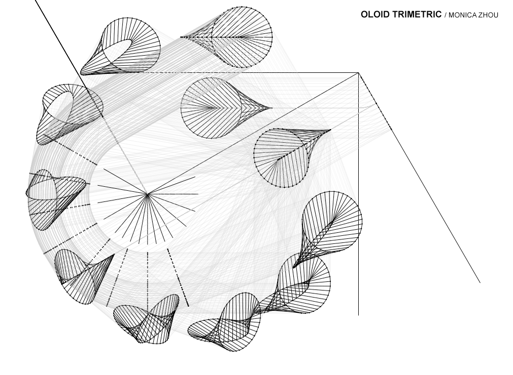

# Trimetric

Given a 2D plan and section image of an object, the user choses by mouse click an axis (the plane that is perpendicular to the line of sight) and the program renders the trimetric projection of the object.
